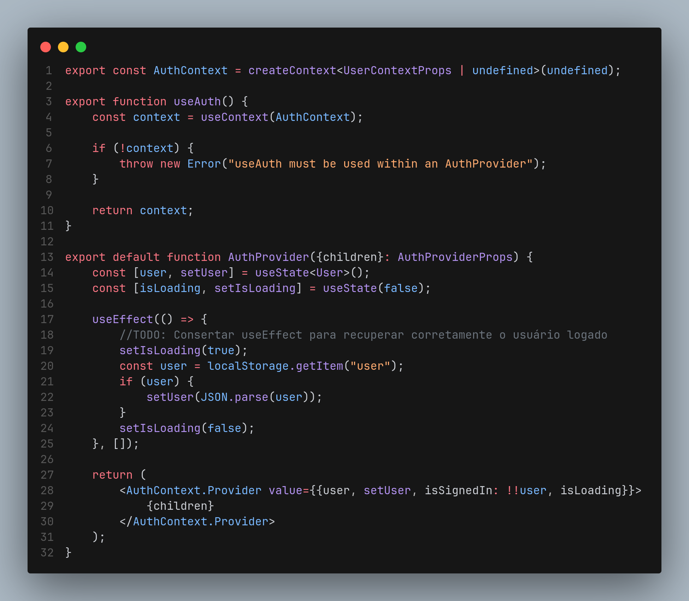
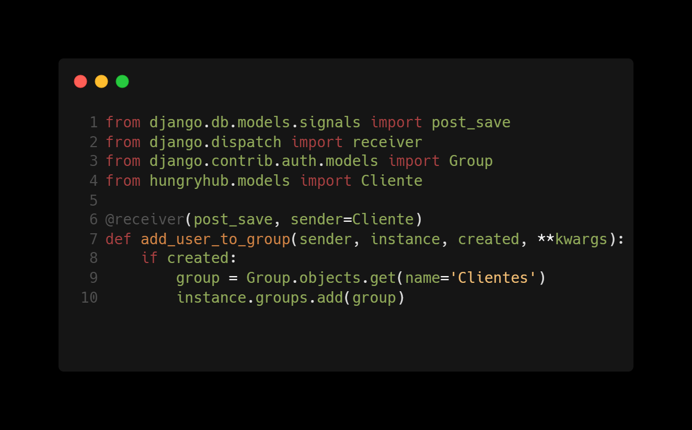

# Observer

## Introdução

<!-- Inclua os seguintes elementos:

- **Objetivo**: Descrever o propósito deste documento.
- **Contexto**: Breve explicação sobre o projeto e sua importância.
- **Escopo**: Delimitação do conteúdo abordado neste documento. -->

## Metodologia

<!-- Explique como as decisões foram tomadas, as ferramentas utilizadas, e justifique escolhas arquiteturais.

- **Processo de Trabalho**: Descrição do método utilizado pela equipe (ex.: Scrum, Kanban).
- **Ferramentas Utilizadas**: Ferramentas empregadas na criação deste artefato (ex.: LucidChart, GitHub).
- **Justificativa**: Razões para as escolhas metodológicas e tecnológicas. -->

## Implementações no Código Fonte

<!-- Descreva como o padrão foi implementado no projeto, incluindo código e diagramas. -->

### useContext do AuthProvider

O padrão **Observer** é implementado implicitamente aqui pelo uso do React Context com hooks. Através do `useContext` e `AuthContext.Provider`, quando o estado de autenticação do usuário (por exemplo, `user` ou `isLoading`) muda, qualquer componente que utilize o contexto será re-renderizado automaticamente para refletir a mudança. Esse comportamento é fundamental no padrão Observer, onde múltiplos componentes "observam" o estado e reagem a mudanças nele.

<b>Implementação no código</b>

**Contexto observa os valores do AuthContext.Provider**

<!-- TODO: Adicionar exemplos da tela de Login e Register quando integrado -->

### Signals do Django

O padrão **Observer** é implementado explicitamente aqui através do uso de `signals` do Django. Quando um novo `Cliente` é criado, o sinal `post_save` é emitido e o método `add_user_to_group` é chamado. Esse método adiciona o novo `Cliente` ao grupo `Clientes`, garantindo que o cliente tenha as permissões corretas.

<b>Implementação no código</b>

**Implementação no [signals.py](https://github.com/UnBArqDsw2024-2/2024.2_G7_Entrega_Entrega_03/blob/main/src/HungryHub.2024.2-Back/hungryhub/signals.py)**

Autores: [Lucas Martins Gabriel](https://github.com/martinsglucas)

### Justificativa Técnica

<!-- - Justificativas das decisões tomadas, incluindo análise de prós e contras. -->

## Rastreabilidade

<!-- Adicione uma seção para mapear decisões a requisitos ou justificativas técnicas.

| Decisão Relacionada               | Justificativa                                 | Elo     | Data       |
| --------------------------------- | --------------------------------------------- | ------- | ---------- |
| Escolha de arquitetura em camadas | Modularidade e separação de responsabilidades | [R01]() | 07/12/2024 | --> 

## Referências

1. 

## Histórico de Versões

| Versão | Data da alteração | Comentário           | Autor(es)                                       | Revisor(es) | Data de revisão |
| ------ | ----------------- | -------------------- | ----------------------------------------------- | ----------- | --------------- |
| 1.0    | 27/12/2024        | Criação do documento | [Guilherme Westphall](https://github.com/west7) |             |                 |