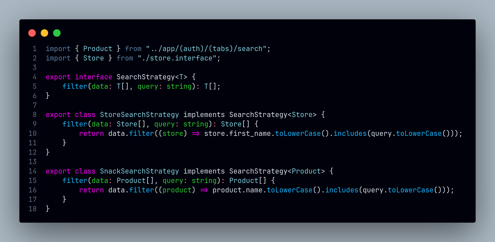
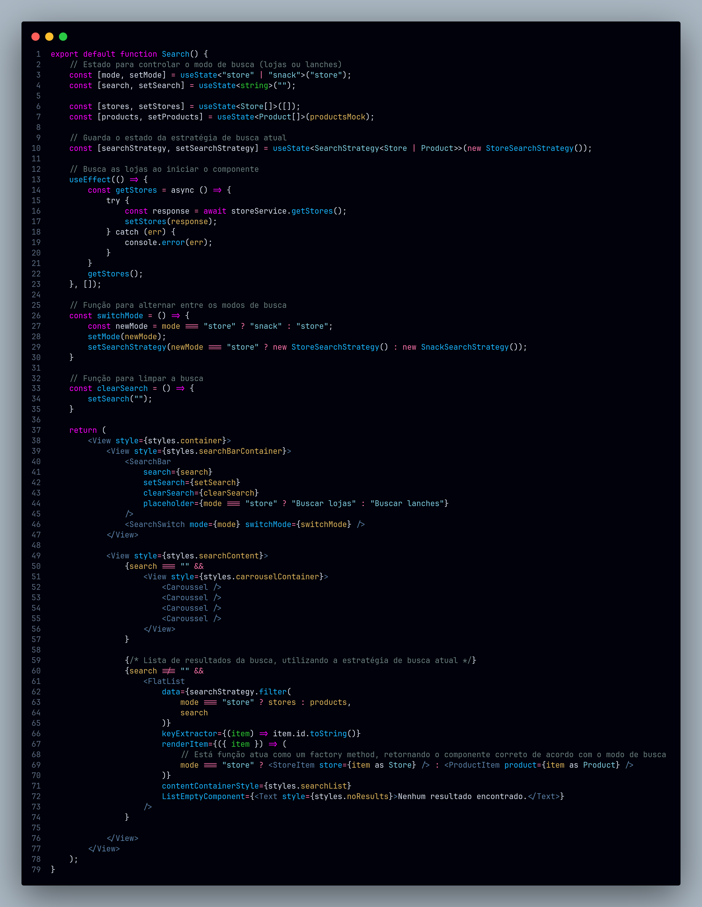

# Strategy

## Introdução
 
O padrão **Strategy** é usado para definir uma família de algoritmos, encapsulá-los e torná-los intercambiáveis. Ele permite que o comportamento de um objeto seja alterado em tempo de execução sem modificar seu código. Esse padrão é útil para tornar o sistema mais flexível, facilitando a adição de novas estratégias sem impactar as existentes.

## Metodologia

<!-- Explique como as decisões foram tomadas, as ferramentas utilizadas, e justifique escolhas arquiteturais.

- **Processo de Trabalho**: Descrição do método utilizado pela equipe (ex.: Scrum, Kanban).
- **Ferramentas Utilizadas**: Ferramentas empregadas na criação deste artefato (ex.: LucidChart, GitHub).
- **Justificativa**: Razões para as escolhas metodológicas e tecnológicas. -->

## Implementações no Código Fonte

<!-- Descreva como o padrão foi implementado no projeto, incluindo código e diagramas. -->

### Estratégia de Pesquisa entre Lojas e Produtos

**Tecnologia:** `React Native`

A tela de pesquisa do aplicativo permite que o usuário escolha entre pesquisar por lojas ou por produtos. Para isso, foi implementado o padrão **Strategy**, que permite a seleção da estratégia de pesquisa a ser utilizada.

<b>Implementação em Código</b>

**Implementação na [searchStrategies.tsx](https://github.com/UnBArqDsw2024-2/2024.2_G7_Entrega_Entrega_03/blob/19-us09/src/HungryHub.2024.2-Front/hungryhub/src/interfaces/searchStrategies.tsx)**:

**Utilização na tela de pesquisa [search.tsx](https://github.com/UnBArqDsw2024-2/2024.2_G7_Entrega_Entrega_03/blob/19-us09/src/HungryHub.2024.2-Front/hungryhub/src/app/(auth)/(tabs)/search.tsx)**:

Autores: [Felipe Amorim de Araújo](https://github.com/lipeaaraujo), [Bruno Cunha Vasconcelos de Araújo](https://github.com/brunocva), [Leonardo Sobrinho de Aguiar](https://github.com/Leonardo0o0), [Raquel Ferreira Andrade](https://github.com/raquel-andrade), [Wolfgang Friedrich Stein](https://github.com/Wolffstein)

### Justificativa Técnica

<!-- - Justificativas das decisões tomadas, incluindo análise de prós e contras. -->

## Rastreabilidade

<!-- Adicione uma seção para mapear decisões a requisitos ou justificativas técnicas.

| Decisão Relacionada | Justificativa | Elo | Data |
| -- | -- | -- | -- |
| Escolha de arquitetura em camadas | Modularidade e separação de responsabilidades | [R01]() | 07/12/2024 | -->

## Referências

1. HEWAWASAM, Lakindu. Using GoF design patterns with React. Blog Bits and Pieces, 4 maio 2023. Disponível em: https://blog.bitsrc.io/using-gof-design-patterns-with-react-c334f3ea3147. Acesso em: 17 dez. 2024.
2. Dev Junior Alves. Como Aplicar Design Patterns do GoF em React.js com TypeScript?!. Youtube, 19 dezembro 2024. Disponível em: https://www.youtube.com/watch?v=t9wKmfFVgJQ. Acesso em: 02 jan. 2024.
3. AWAN, Talha. GOF Design Patterns in React JS. TecHighness. 21 maio 2022. Disponível em: https://www.techighness.com/post/gof-design-patterns-react-js/. Acesso em: 02 jan. 2024.

## Histórico de Versões

| Versão | Data da alteração | Comentário | Autor(es) | Revisor(es) | Data de revisão |
|--------|-----------|-----------|-----------|-------------|-------------|
| 1.0 | 05/01/2025 | Criação do documento e adição do exemplo da pesquisa | [Felipe Amorim de Araújo](https://github.com/lipeaaraujo), [Raquel Ferreira Andrade](https://github.com/raquel-andrade) | [Gabryel Nicolas S de Sousa](https://github.com/gabryelns) | 06/01/2025 |
| 1.1 | 06/01/2025 | adição da introdução | [Gabryel Nicolas S de Sousa](https://github.com/gabryelns) |  |  |