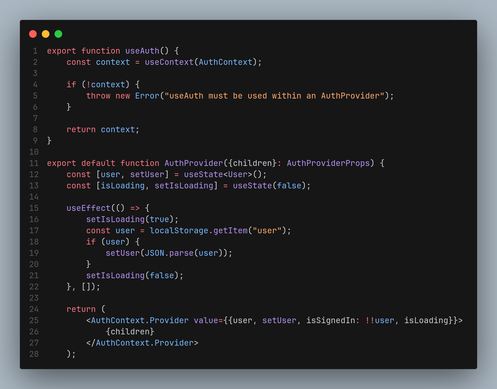
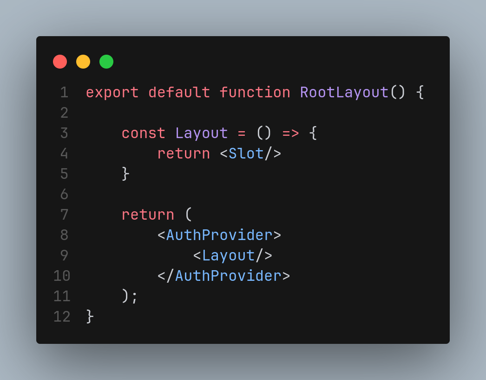

# Singleton

## Introdução
  
O padrão criacional **Singleton** busca garantir que uma classe tenha apenas uma única instância e forneça um ponto global de acesso a ela, o que a faz ser muito utilizada em situações que exigem controle centralizado, como no gerenciamento de recursos.  Com uma implementação simples, o Singleton evita duplicação desnecessária e promove consistência no sistema.

## Metodologia

<!-- Explique como as decisões foram tomadas, as ferramentas utilizadas, e justifique escolhas arquiteturais.

- **Processo de Trabalho**: Descrição do método utilizado pela equipe (ex.: Scrum, Kanban).
- **Ferramentas Utilizadas**: Ferramentas empregadas na criação deste artefato (ex.: LucidChart, GitHub).
- **Justificativa**: Razões para as escolhas metodológicas e tecnológicas. -->

## Implementações no Código Fonte

<!-- Descreva como o padrão foi implementado no projeto, incluindo código e diagramas. -->

### Componente de Input para Formulário

**Tecnologia:** `React Native`

O padrão **Singleton** é aplicado de forma implícita ao `AuthContext`, porque o contexto `AuthContext` garante que haja apenas uma instância desse contexto em toda a aplicação. Esse contexto fornece uma maneira global de acessar o estado de autenticação do usuário, permitindo que qualquer componente acesse o mesmo objeto de contexto, ou seja, uma única instância.

<b>Implementação em Código</b>

**Componente** [AuthProvider.jsx]()

**Instância única do AuthProvider no RootLayout** [_layout.tsx]()

Autores: [Guilherme Westphal](https://github.com/west7)

<!-- ### Justificativa Técnica - Justificativas das decisões tomadas, incluindo análise de prós e contras. -->

<!-- ## Rastreabilidade Adicione uma seção para mapear decisões a requisitos ou justificativas técnicas.

| Decisão Relacionada               | Justificativa                                 | Elo     | Data       |
| --------------------------------- | --------------------------------------------- | ------- | ---------- |
| Escolha de arquitetura em camadas | Modularidade e separação de responsabilidades | [R01]() | 07/12/2024 | --> 

## Referências

1. HEWAWASAM, Lakindu. Using GoF design patterns with React. Blog Bits and Pieces, 4 maio 2023. Disponível em: https://blog.bitsrc.io/using-gof-design-patterns-with-react-c334f3ea3147. Acesso em: 17 dez. 2024.
2. Dev Junior Alves. Como aplicar Design Patterns no React com hooks?!. Youtube, 23 maio 2024. Disponível em: https://www.youtube.com/watch?v=kK-4Cpt5_o4. Acesso em: 17 dez. 2024.
3. Dev Junior Alves. Como Aplicar Design Patterns do GoF em React.js com TypeScript?!. Youtube, 19 dezembro 2024. Disponível em: https://www.youtube.com/watch?v=t9wKmfFVgJQ. Acesso em: 02 jan. 2024.
4. AWAN, Talha. GOF Design Patterns in React JS. TecHighness. 21 maio 2022. Disponível em: https://www.techighness.com/post/gof-design-patterns-react-js/. Acesso em: 02 jan. 2024.

## Histórico de Versões

| Versão | Data da alteração | Comentário           | Autor(es)                                      | Revisor(es) | Data de revisão |
| ------ | ----------------- | -------------------- | ---------------------------------------------- | ----------- | --------------- |
| 1.0    | 27/12/2024        | Criação do documento | [Guilherme Westphall](https://github.com/west7) | [Kallyne Macedo Passos](https://github.com/kalipassos)  | 05/01/2025 |
| 1.1 | 27/12/2024 | Adição do exemplo do AuthProvider | [Guilherme Westphall](https://github.com/west7) |[Kallyne Macedo Passos](https://github.com/kalipassos)  | 05/01/2025 |