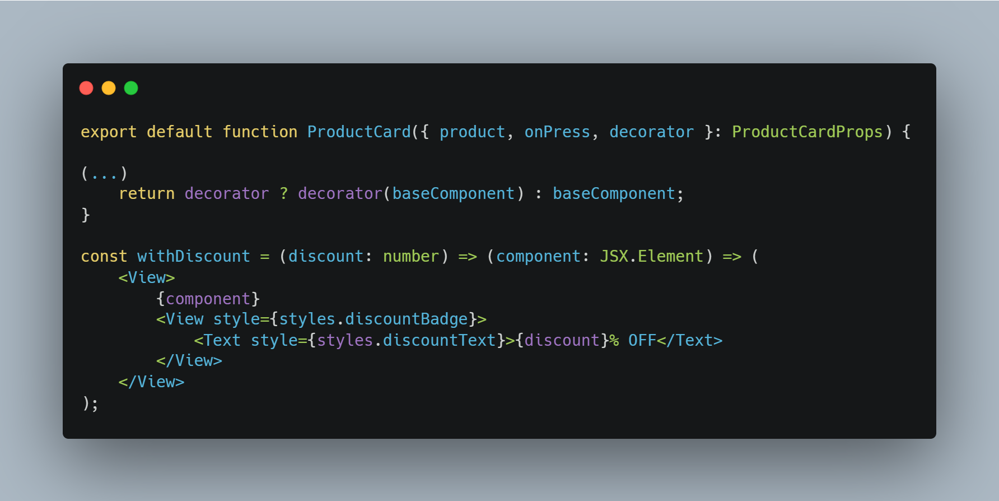

# Decorator

## Introdução

<!-- Inclua os seguintes elementos:

- **Objetivo**: Descrever o propósito deste documento.
- **Contexto**: Breve explicação sobre o projeto e sua importância.
- **Escopo**: Delimitação do conteúdo abordado neste documento. -->

O padrão Decorator é um padrão estrutural que permite adicionar novos comportamentos a objetos dinamicamente, envolvendo-os em objetos wrapper. No contexto deste componente React Native, o Decorator possibilita adicionar elementos visuais (badges de desconto e indicadores de novidade) aos cards de produto sem modificar sua estrutura base, mantendo o código flexível e extensível.

## Exemplo de Implementação no Projeto

### Decorator em ProductCard React Native

**Tecnologia:** `React Native`

Decorator implementado para adicionar funcionalidades visuais dinâmicas aos cards de produto, como a indicação de descontos no produto. Permite extensão de características sem modificar o componente base.

<b>Implementação no código</b>

**[Decorator.tsx](https://github.com/UnBArqDsw2024-2/2024.2_G7_Entrega_Entrega_03/blob/553596b858fe00bc8a2990a2b171e84cf9c2539d/src/HungryHub.2024.2-Front/hungryhub/src/components/ProductCard.tsx)**:

Autor: [Kallyne Macedo Passos](https://github.com/kalipassos)

### Decorator em ProfileButton React Native

**Tecnologia:** `React Native`

O padrão **Decorator** é observado no componente `ProfileButton`, onde diferentes comportamentos e estilos são adicionados dinamicamente ao botão, dependendo da propriedade `isLogout`. Esse comportamento permite adicionar funcionalidades ou modificações visuais sem alterar a estrutura base do componente.

<b>Implementação no Código</b>

Autor: [Kauan Eiras](https://github.com/kauaneiras)

## Referências

1. HEWAWASAM, Lakindu. Using GoF design patterns with React. Blog Bits and Pieces, 4 maio 2023. Disponível em: https://blog.bitsrc.io/using-gof-design-patterns-with-react-c334f3ea3147. Acesso em: 17 dez. 2024.
2. Dev Junior Alves. Como Aplicar Design Patterns do GoF em React.js com TypeScript?!. Youtube, 19 dezembro 2024. Disponível em: https://www.youtube.com/watch?v=t9wKmfFVgJQ. Acesso em: 02 jan. 2024.
3. AWAN, Talha. GOF Design Patterns in React JS. TecHighness. 21 maio 2022. Disponível em: https://www.techighness.com/post/gof-design-patterns-react-js/. Acesso em: 02 jan. 2024.

## Histórico de Versões

| Versão | Data da alteração | Comentário | Autor(es) | Revisor(es) | Data de revisão |
|--------|-----------|-----------|-----------|-------------|-------------|
| 1.0 | 05/01/2025 | Criação do documento |  [Kallyne Macedo Passos](https://github.com/kalipassos) | [Kauan Eiras](https://github.com/kauaneiras) | 06/01/2025 |
| 1.1 | 06/01/2025 | Adição de exemplo de implementação no projeto | [Kauan Eiras](https://github.com/kauaneiras) |