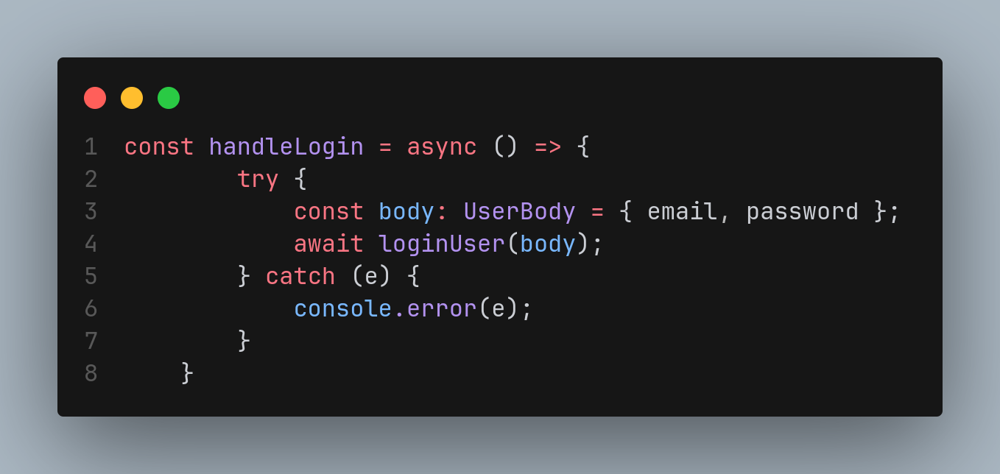

# Facade

## Introdução

<!-- Inclua os seguintes elementos:

- **Objetivo**: Descrever o propósito deste documento.
- **Contexto**: Breve explicação sobre o projeto e sua importância.
- **Escopo**: Delimitação do conteúdo abordado neste documento. -->

## Metodologia

<!-- Explique como as decisões foram tomadas, as ferramentas utilizadas, e justifique escolhas arquiteturais.

- **Processo de Trabalho**: Descrição do método utilizado pela equipe (ex.: Scrum, Kanban).
- **Ferramentas Utilizadas**: Ferramentas empregadas na criação deste artefato (ex.: LucidChart, GitHub).
- **Justificativa**: Razões para as escolhas metodológicas e tecnológicas. -->

## Implementações no Código Fonte

<!-- Descreva como o padrão foi implementado no projeto, incluindo código e diagramas. -->

### Função `handleLogin` na tela de Login

**Tecnologia:** `React Native`

A função `handleLogin` atua como uma fachada para o processo de login. Ela encapsula a complexidade da lógica de autenticação, incluindo a construção do objeto UserBody, a chamada da função `loginUser`, o tratamento de erros e a navegação do usuário em uma única função. Os detalhes internos são escondidos do restante do componente.

<b>Implementação em Código</b>

**Função** [handleLogin]()

Autores: [Guilherme Westphall](https://github.com/west7)

### Justificativa Técnica

<!-- - Justificativas das decisões tomadas, incluindo análise de prós e contras. -->

## Rastreabilidade

<!-- Adicione uma seção para mapear decisões a requisitos ou justificativas técnicas.

| Decisão Relacionada               | Justificativa                                 | Elo     | Data       |
| --------------------------------- | --------------------------------------------- | ------- | ---------- |
| Escolha de arquitetura em camadas | Modularidade e separação de responsabilidades | [R01]() | 07/12/2024 | --> 

## Referências

1. 

## Histórico de Versões

| Versão | Data da alteração | Comentário                   | Autor(es)                                       | Revisor(es) | Data de revisão |
| ------ | ----------------- | ---------------------------- | ----------------------------------------------- | ----------- | --------------- |
| 1.0    | 27/12/2024        | Criação do documento         | [Guilherme Westphall](https://github.com/west7) |             |                 |
| 1.1    | 27/12/2024        | Adição da função handleLogin | [Guilherme Westphall](https://github.com/west7) |             |                 |