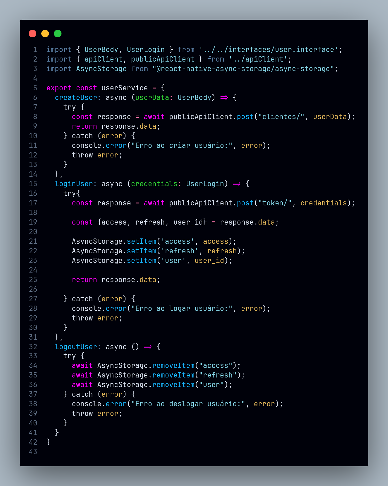
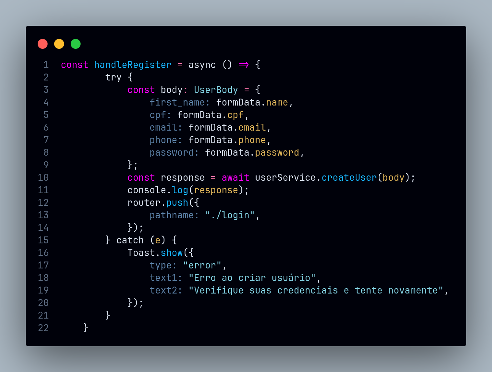
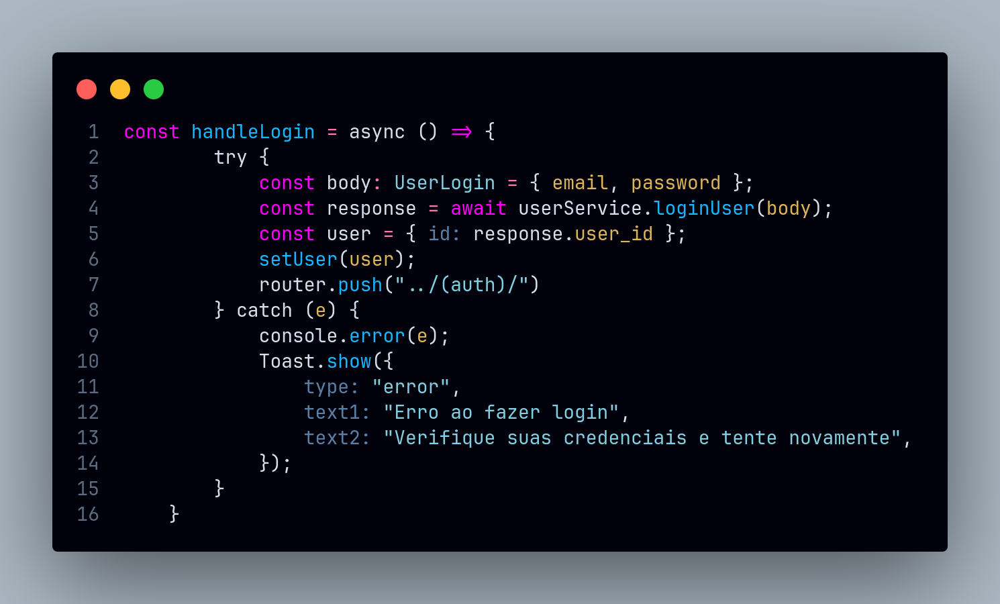

# Facade

## Introdução

<!-- Inclua os seguintes elementos:

- **Objetivo**: Descrever o propósito deste documento.
- **Contexto**: Breve explicação sobre o projeto e sua importância.
- **Escopo**: Delimitação do conteúdo abordado neste documento. -->

## Metodologia

<!-- Explique como as decisões foram tomadas, as ferramentas utilizadas, e justifique escolhas arquiteturais.

- **Processo de Trabalho**: Descrição do método utilizado pela equipe (ex.: Scrum, Kanban).
- **Ferramentas Utilizadas**: Ferramentas empregadas na criação deste artefato (ex.: LucidChart, GitHub).
- **Justificativa**: Razões para as escolhas metodológicas e tecnológicas. -->

## Implementações no Código Fonte

<!-- Descreva como o padrão foi implementado no projeto, incluindo código e diagramas. -->

### Encapsulamento de chamadas de API do serviço de usuário

**Tecnologia:** `React Native`

Encapsulamento de chamadas de API do serviço de usuário em um único arquivo, facilitando a manutenção e a reutilização do código, por meio de um arquivo de fachada (**Facade**) que contém os métodos de chamada da API. O serviço de usuário é responsável por fazer as chamadas de operações CRUD (Create, Read, Update, Delete) do usuário e autenticação para a API.

<b>Implementação em Código</b>

**Serviço [user.service.tsx](https://github.com/UnBArqDsw2024-2/2024.2_G7_Entrega_Entrega_03/blob/12-us01/src/HungryHub.2024.2-Front/hungryhub/src/api/services/user.service.tsx)**:

**Utilização na tela de registro [register.tsx](https://github.com/UnBArqDsw2024-2/2024.2_G7_Entrega_Entrega_03/blob/12-us01/src/HungryHub.2024.2-Front/hungryhub/src/app/(public)/register.tsx)**:

**Utilização na tela de login [login.tsx](https://github.com/UnBArqDsw2024-2/2024.2_G7_Entrega_Entrega_03/blob/12-us01/src/HungryHub.2024.2-Front/hungryhub/src/app/(public)/login.tsx)**:

Autores: [Felipe Amorim de Araújo](https://github.com/lipeaaraujo), [Lucas Martins Gabriel](https://github.com/martinsglucas), [Guilherme Westphall de Queiroz](https://github.com/west7)

### Justificativa Técnica

<!-- - Justificativas das decisões tomadas, incluindo análise de prós e contras. -->

## Rastreabilidade

<!-- Adicione uma seção para mapear decisões a requisitos ou justificativas técnicas.

| Decisão Relacionada | Justificativa | Elo | Data |
| -- | -- | -- | -- |
| Escolha de arquitetura em camadas | Modularidade e separação de responsabilidades | [R01]() | 07/12/2024 | -->

## Referências

1. HEWAWASAM, Lakindu. Using GoF design patterns with React. Blog Bits and Pieces, 4 maio 2023. Disponível em: https://blog.bitsrc.io/using-gof-design-patterns-with-react-c334f3ea3147. Acesso em: 02 jan. 2025.
2. Dev Junior Alves. Como aplicar Design Patterns no React com hooks?!. Youtube, 23 maio 2024. Disponível em: https://www.youtube.com/watch?v=kK-4Cpt5_o4. Acesso em: 02 jan. 2025.
3. AWAN, Talha. GOF Design Patterns in React JS. TecHighness. 21 maio 2022. Disponível em: https://www.techighness.com/post/gof-design-patterns-react-js/. Acesso em: 02 jan. 2025.

## Histórico de Versões

| Versão | Data da alteração | Comentário | Autor(es) | Revisor(es) | Data de revisão |
|--------|-----------|-----------|-----------|-------------|-------------|
| 1.0 | 02/01/2025 | Criação do documento | [Felipe Amorim de Araújo](https://github.com/lipeaaraujo) |  |  |
| 1.1 | 02/01/2025 | Adição da implementação do serviço de usuário | [Felipe Amorim de Araújo](https://github.com/lipeaaraujo), [Lucas Martins Gabriel](https://github.com/martinsglucas), [Guilherme Westphall de Queiroz](https://github.com/west7) |  |  |